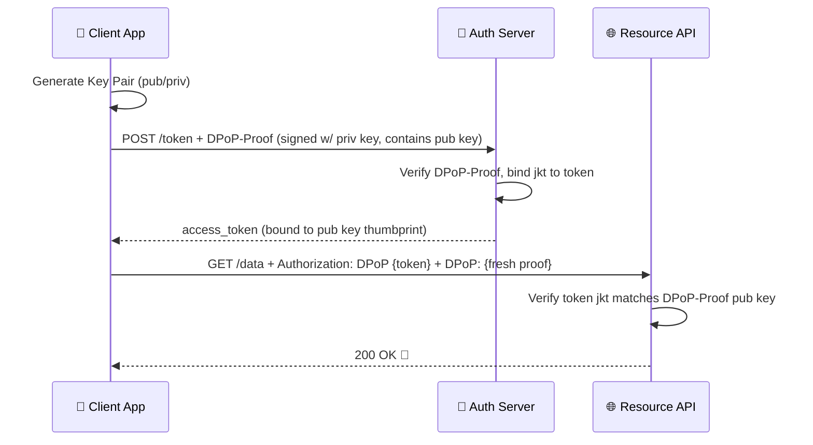

# DPoP Flow Diagram

```mermaid {scale: 0.75}
sequenceDiagram
    participant App as 📱 Client App
    participant AS as 🔐 Auth Server
    participant API as 🌐 Resource API

    App->>App: Generate Key Pair (pub/priv)
    App->>AS: POST /token + DPoP-Proof (signed w/ priv key, contains pub key)
    AS->>AS: Verify DPoP-Proof, bind jkt to token
    AS-->>App: access_token (bound to pub key thumbprint)

    App->>API: GET /data + Authorization: DPoP {token} + DPoP: {fresh proof}
    API->>API: Verify token jkt matches DPoP-Proof pub key
    API-->>App: 200 OK 🎉
```

  Even if the <code>access_token</code> is stolen, it's useless without the private key 🔑

